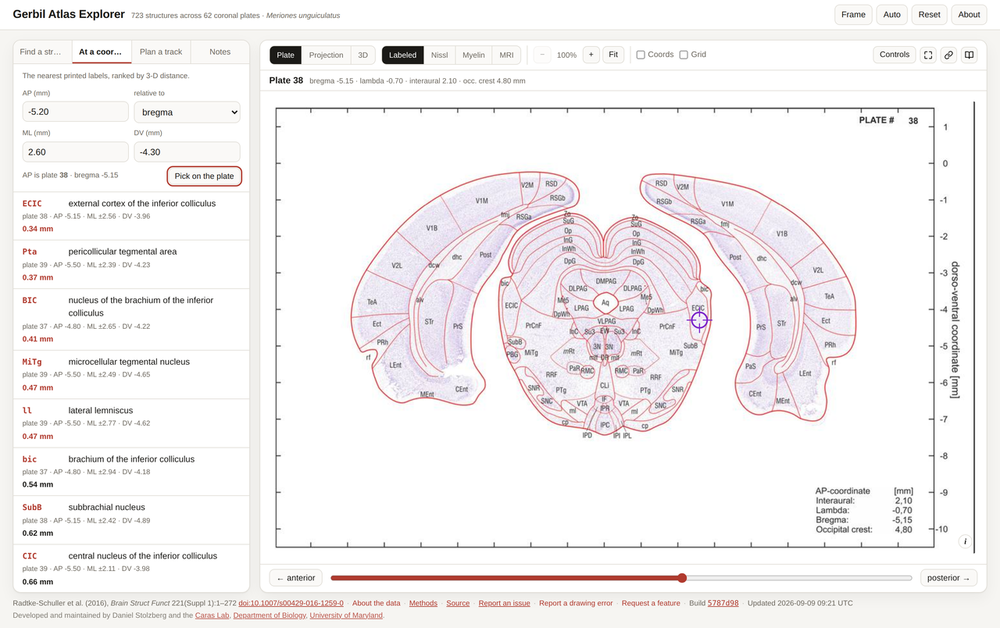

# At a Coordinate

The reverse lookup: you have a point, you want to know what is there. Left panel,
**At a coordinate**.

## Typing a point

Four fields:

| Field | Notes |
| --- | --- |
| **AP (mm)** | Anterior is positive |
| **relative to** | bregma · lambda · interaural · occipital crest |
| **ML (mm)** | Right is positive; matched to whichever hemisphere is closer |
| **DV (mm)** | Dorsal is positive, so depths are negative |

The panel then lists **the nearest printed labels, ranked by 3-D distance**, each with how
far it sits from your point. Click one to select that structure as usual.

The line under the fields tells you which plate the AP resolves to, and its bregma — click
it to go there.

*Bregma −5.20, ML 2.60, DV −4.30 resolves to plate 38, where the crosshair is drawn solid.
The nearest printed labels are listed with their distances — the closest, ECIC, 0.34 mm away.*

## Picking on the plate instead

**Pick on the plate** arms the plate; your next click on it fills the fields in — **ML and
DV from the point you clicked, AP from the plate it was on**. Faster than typing when you
are aiming at something you can see.

It reads the click, not the hover, so moving the pointer across the image on its way to
the button does not disturb anything.

## The crosshair

Your point is drawn on the plate as a crosshair, so you can see what you asked for rather
than imagining it. It is drawn **solid** on the plate the AP resolves to and **faint** on
any other — so you can still read your ML and DV against a neighbouring level, without the
app pretending the AP matches.

## Two limits worth knowing

- **AP resolves only to the nearest plate** — 350 µm. There is nothing between plates to
  resolve to.
- **The results are printed labels, not a segmentation.** "Nearest label" is not the same
  as "inside that structure". A point can sit squarely in a region whose abbreviation
  happens to be printed further away than a neighbour's.

With a [working frame](Working-Frame) on, the three fields are read **in your frame** and
inverted back to atlas space, and the landmark dropdown steps aside — lambda, interaural
and the occipital crest have no ML or DV recorded anywhere, so their position in a tilted
frame cannot be worked out honestly.
