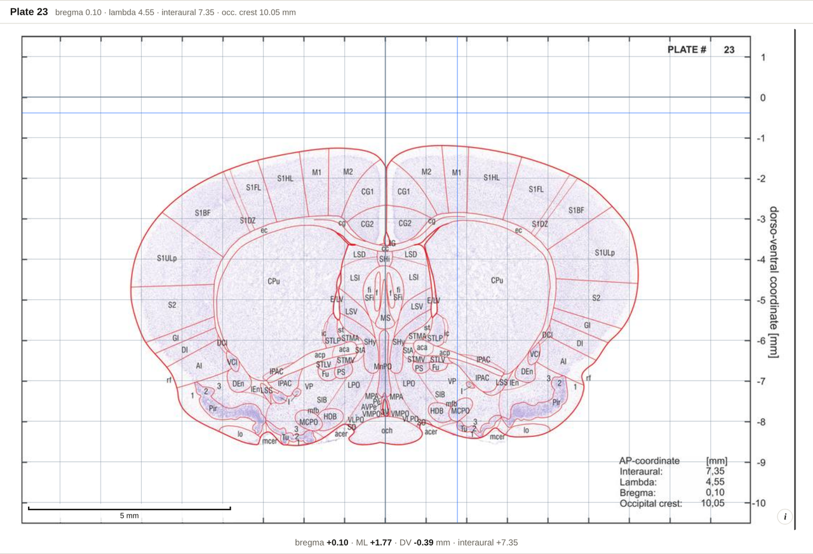

# Coordinates

Everything in the app is in **millimetres**, in the atlas's own stereotaxic space.

## The three axes

| Axis | Zero | Positive direction |
| --- | --- | --- |
| **AP** (anteroposterior) | bregma, by default | anterior |
| **ML** (mediolateral) | the midsagittal plane | right |
| **DV** (dorsoventral) | the plane through the most dorsal points of cerebrum and cerebellum | dorsal (so brain depths are **negative**) |

Sections are **coronal**, cut perpendicular to the brainstem axis, **350 µm** apart.

> **DV 0 is the brain surface, not skull bregma.** The two differ by roughly the skull
> thickness. If you zero your manipulator on bone, say so in the
> [working frame](Working-Frame) dialog.

## AP landmarks

The atlas prints an AP for four landmarks, and they are exact — a fixed offset apart:

| Landmark | AP, relative to bregma |
| --- | --- |
| bregma | 0 |
| lambda | +4.45 mm |
| interaural line | +7.25 mm |
| occipital crest | +9.95 mm |

So a point at bregma −2.30 is at lambda +2.15. Anywhere the app asks you for an AP it also
lets you say which of these it is measured from; and the [working frame](Working-Frame)
dialog can switch every readout in the app over to one of them permanently.

The plates run from **bregma +7.80 mm** (plate 1) to **bregma −13.55 mm** (plate 62), at
−0.35 mm per plate. These were read from all 62 plates and match the printed series exactly.

**The atlas prints no ML or DV for these landmarks** — only an AP. That is why the frame
dialog's landmark presets set AP only, and why you supply ML and DV yourself if you need
them.

## What a structure's coordinate actually is

**The median position of where the structure's abbreviation is printed** across all the
plates it appears on.

That is near — but not identical to — the structure's centroid. For thin, layered or
curved structures the label is often placed just *outside* the region it names, with a
leader line. Read the coordinate as *"this is roughly where to look"*, then read the plate.

The card also gives the **label extent**: the full ML and DV spread of those labels, which
tells you how tightly the figure is defined. A structure with six labels spread over
3 mm of DV is not a point.

**ML is folded across the midline** and written `±`, because a bilateral structure's two
hemispheres would otherwise average out to ML 0.

## Where the ML and DV scale comes from

*The 1 mm stereotaxic grid over plate 23, with the scale bar and the pointer readout. ML 0
is the midline; DV 0 the brain's dorsal surface, so everything below it is negative.*

Each plate carries the atlas's own printed coordinate box (ML ±8 mm, DV +1 to −10 mm), and
every page was cropped to its own box. That makes one common coordinate space across all
62 plates and all three sources. Midline structures land within 0.2 mm of ML 0, and
bilateral pairs come out symmetric.

## Reading in a different frame

If your stereotaxic frame holds the head at a different angle, or you zero on lambda, the
[working frame](Working-Frame) dialog restates the readouts in your frame. Moving the
origin is an exact subtraction; rotating is experimental.

---

Full derivation and error analysis:
[METHODS.md](https://github.com/dstolz/GerbilAtlasExplorer/blob/main/METHODS.md).
