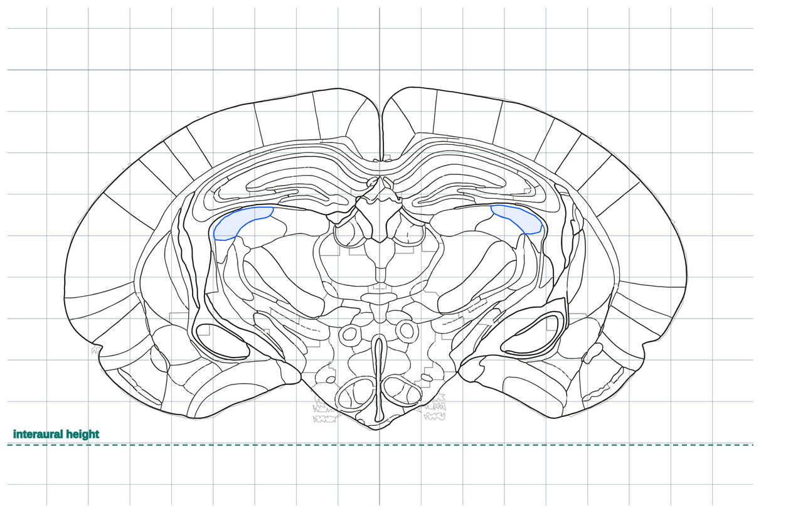

# Exporting

Four ways to take something out of the app. Everything happens in your browser — no upload.

---

## PNG — the plate as a picture

**PNG**, under **Controls → Notes and export**. Saves the plate exactly as shown: the current source
(Labeled / Nissl / Myelin), the grey and contrast settings, every overlay that is on, and
a coordinate caption.

Use it when you want the histology in the figure.

---

## SVG — the plate as editable vector paths

**SVG**, beside it. Saves the **same sheet**, but the plate is **regional outlines as
vector paths** instead of a photograph — traced off the printed plate — with whatever
overlays were showing and the same caption. About 10–80 kB.



*The SVG for plate 30 with DLG selected, the grid and the landmarks on, opened in a browser.
The section image is not in it — every line is a vector path.*

**The section image is not in the file.** This is the drawing, not the histology.

Every part is its own named group, so a figure can be restyled or cut down without
redrawing anything:

`outlines-solid` · `outlines-dashed` · `grid` · `skull` · `landmarks` · `highlight` ·
`measure` · `track` · `query` · `caption`

Opens in Illustrator, Inkscape, or a browser.

<details>
<summary>How the outlines are registered</summary>

The tracing was done on the published pages at 3296 × 2481 px and is kept in that frame;
each plate carries the matrix that puts it on the 1100 × 703 crop everything else here
measures in. That matrix is **fitted to each plate's own printed ink**, not assumed from
the page layout — which is what catches the pages the journal set sideways or off-centre.
Plate 20 is printed at a quarter turn, and plate 31 comes out 47 px low. Every plate lands
within 1.8 px of its own drawn lines, about 0.03 mm.
</details>

---

## CSV — the structure list as data

**CSV**, at the top-right of the result list. Downloads **exactly the structures currently
listed** — so filter first, then export.

Columns:

| Column | |
| --- | --- |
| `abbr`, `name` | Identity |
| `first_plate`, `last_plate`, `n_plates`, `plates` | Plate coverage |
| `bregma_anterior_mm`, `bregma_posterior_mm` | AP span from bregma |
| `lambda_anterior_mm`, `lambda_posterior_mm` | …from lambda |
| `interaural_anterior_mm`, `interaural_posterior_mm` | …from the interaural line |
| `label_AP_bregma_mm`, `label_ML_abs_mm`, `label_DV_mm` | The label-centre coordinate |
| `n_labels` | How many printed labels it came from |
| `systems` | The tags, space-separated |

With a [working frame](Working-Frame) on, extra columns are **added beside** the atlas
ones, never in place of them — plus a `frame_spec` column recording the exact frame
(angles, origin, pivot, offset, rotation order, sign conventions). A CSV outlives the
session that made it, so the file carries both readings and says which frame produced the
second.

UTF-8 with a BOM, CRLF line endings — opens cleanly in Excel.

---

## Copy link — the whole view as a URL

**Copy link**, at the right of the toolbar. Puts a URL on your clipboard that restores what
you are looking at. Paste it into a lab notebook, a message, or a paper's methods.

The link looks like:

```
…/gerbil_atlas_explorer.html#p30/MGV&v=rg&ps=nissl&t=plate
```

It carries, when they differ from the default:

- the **plate** and the **selected structure** (`#p30/MGV`)
- **zoom and pan**
- which **overlays** are on
- the **source** (Nissl / Myelin), the **contrast**, and grey
- which **view** you are in, and the projection orientation
- the **3D** settings — rendering mode, plate slab, half, ortho, skull opacity
- the **planned track** — target, side and all three angles
- the **working frame**

The URL in the address bar updates as you work — it is rewritten in place rather than
pushed as history — so you can copy it from there at any time, or bookmark a view.

**A link is just text** — it works offline too, against your own downloaded copy of the
file.

---

## The plan, as text

In the track planner: **Copy notes** puts the plan on the clipboard as plain text, and
**Download** writes it to a file. Both record the frame it was planned in and any
measurement you had on the plate. See [Planning a Track](Planning-a-Track).
