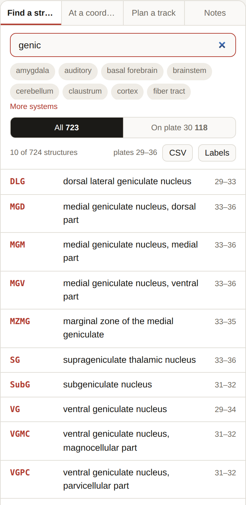
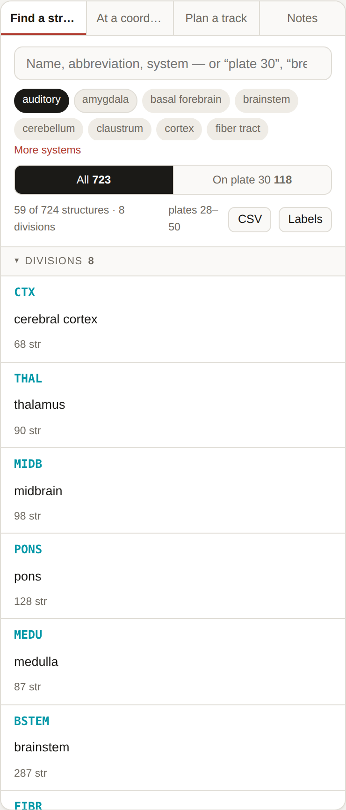
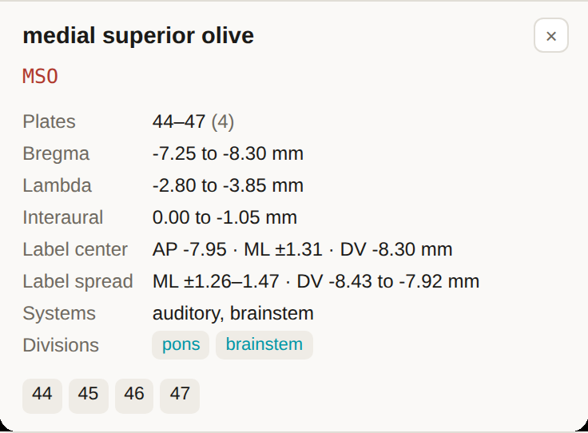

# Finding Structures

The left panel's first mode, **Find a structure**. Press <kbd>/</kbd> from anywhere to jump
to the search box.

## What you can type

| You type | You get |
| --- | --- |
| `MSO` | The abbreviation, exactly as the atlas prints it |
| `medial superior olive` | Any part of the full name |
| `auditory cortex`, `MGB`, `IC` | Common **aliases** — informal names mapped to the atlas's abbreviations |
| `auditory`, `thalamus` | A **system** — same as clicking the chip |
| `plate 30` or `p30` | Jumps straight to that plate |
| `bregma -2.3` | Jumps to the plate nearest that AP |

Search is case-insensitive and ignores spaces in abbreviations. Partial words work:
`genic` finds the geniculate nuclei.

*`genic` finds ten structures across plates 29–36 — every geniculate nucleus the atlas
indexes, without you having to know which of them is spelt out and which is an
abbreviation.*

## Narrowing the list

**System chips** sit under the search box. Click one or more to keep only structures
carrying that tag; click again to release. *More systems* reveals the rest.

The tags, with how many structures carry each:

| Tag | n | Tag | n | Tag | n |
| --- | --- | --- | --- | --- | --- |
| thalamus | 123 | cortex | 62 | monoaminergic | 33 |
| fiber_tract | 112 | auditory | 59 | amygdala | 32 |
| brainstem | 93 | cerebellum | 55 | ventricular | 25 |
| midbrain | 84 | motor | 52 | vestibular | 15 |
| hypothalamus | 68 | visual | 43 | vascular | 3 |
| | | somatosensory | 42 | claustrum | 3 |
| | | hippocampal | 37 | landmark | 2 |
| | | basal_forebrain | 34 | | |
| | | olfactory | 34 | | |

> The system tags are a convenience layer added here — they are **not** part of the
> published atlas. Treat them as a way to sweep a pathway, not as an authority.

**Scope** — the two-button strip below the chips:

- **All 723** — the whole atlas.
- **On plate 30** — only structures the index lists for the plate currently showing. This
  follows you as you step through plates, which makes it a good way to read a level:
  set the scope, then walk the slider and watch the list change.

Filters combine: chips **and** scope **and** the text you typed.

*The **auditory** chip alone: 59 of 724 structures, spanning plates 28–50. With nothing
typed in the box the list opens grouped by anatomical division; type anything and it
becomes a flat list of structures.*

## The result list

Each row is `abbreviation · full name · plate range`. Click a row and two things happen:

- the structure is **selected** — circled on the plate, highlighted in the projection and
  3D views;
- the viewer jumps to the **first plate** the structure appears on.

The list shows up to 400 rows; past that it asks you to narrow the search. The line above
it always tells you how many matched and the plate range they span.

## The structure card

Selecting a structure opens a card under the list:

| Row | What it is |
| --- | --- |
| **Plates** | The plate range it is indexed for, and how many plates that is |
| **Bregma** / **Lambda** / **Interaural** | The same range as an AP span, from each landmark |
| **Label center** | The stereotaxic coordinate — AP · ML · DV — the median of its printed labels |
| **Label spread** | The full ML and DV spread of those labels |
| **Systems** | The tags it carries |
| **Divisions** | The anatomical divisions it is filed under — click one to list its siblings |

Under that is a row of **plate-number buttons** — click any one to jump straight to that
level.

ML is written `±` because the two hemispheres are folded together; a bilateral structure
would otherwise average out to ML 0. With a [working frame](Working-Frame) rotated, the
symmetry breaks and the card gives a left and a right line instead, keeping the atlas
figure beside each.

If a structure has no located label, the *Label center* and *Label spread* rows are simply
absent rather than showing a made-up number. Twenty of the 723 structures are in that
state — see [Accuracy and Caveats](Accuracy-and-Caveats).

Press <kbd>Esc</kbd> (or the **×** on the card) to drop the selection.

## Getting the list out

**CSV** (top-right of the list) downloads exactly the structures currently listed, with
their coordinates. See [Exporting](Exporting) for the columns.
