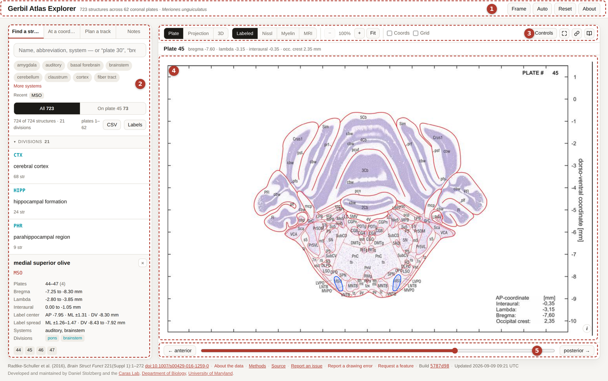

# Getting Started

## Opening it

**Online** — [open the Explorer](https://dstolz.github.io/GerbilAtlasExplorer/gerbil_atlas_explorer.html).
Any modern browser. No account, no install.

**Offline** — download `gerbil_atlas_explorer.html` from the
[repository](https://github.com/dstolz/GerbilAtlasExplorer) and double-click it. The whole
atlas (all 186 plate images, the traced outlines, the skull mesh) is inside that one file,
so it works on a rig computer with no internet. It is about 20 MB, and the first load takes
a few seconds.

Nothing you do is sent anywhere. There is no server.

## The screen

*The medial superior olive selected: circled on plate 45, with its card under the result list.*

1. **Header** — *Frame* (where zero is), the theme button (cycles **Auto** → **Light** →
   **Dark**, and remembers your choice), *Reset* (open the site fresh), and *About* (the
   data, the method, the caveats).
2. **Left panel** — how you ask a question. Four modes, switched at the top:
   *Find a structure*, *At a coordinate*, *Plan a track*, *Notes*. The search box, the
   system chips and the result list live here, and a selected structure's card opens under
   them.
3. **Toolbar** — which view you are in (*Plate* · *Projection* · *3D*), which source is
   showing (*Labeled* · *Nissl* · *Myelin*), zoom, the two overlays you reach for most
   (*Coords*, *Grid*), and **Controls**, which opens the rest.
4. **Viewer** — the answer, drawn. The plate, the projection scatter or the 3-D stack.
5. **Plate slider** — step or drag through the 62 levels, anterior to posterior.

On a narrow screen the two panels stack, plate first.

## The first five things to try

1. Type `MSO` in the search box and click the result. The plate opens with the medial
   superior olive circled.
2. Tick **Coords** above the plate, then move your pointer over the section. Bregma, ML and
   DV update under the plate as you go.
3. Hover one of the printed abbreviations on the drawing — it names the structure. Click it
   and the app selects it.
4. Click **Nissl**. Same level, same coordinates, the actual stained section.
5. Press **→** a few times to walk posterior, then **0** to fit the plate again.

## Where to go next

- Searching properly, including filters: [Finding Structures](Finding-Structures)
- Everything on the plate toolbar: [Reading a Plate](Reading-a-Plate)
- What the numbers mean: [Coordinates](Coordinates)
