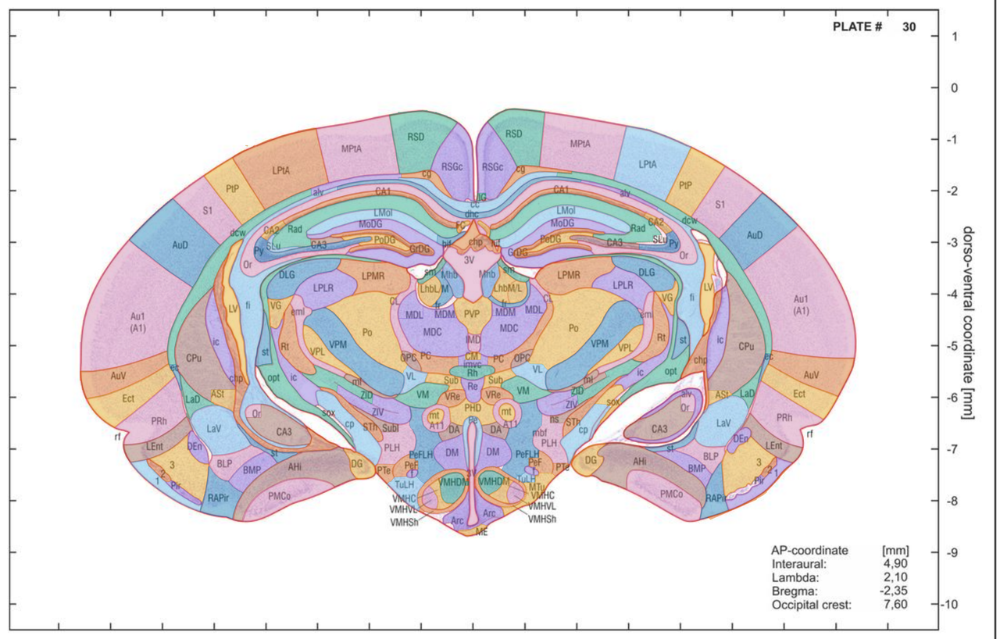

# Gerbil Atlas Explorer

A searchable, clickable version of the **Radtke-Schuller et al. (2016)** Mongolian gerbil
brain atlas: **723 structures** across **62 coronal plates**, each with stereotaxic
coordinates, and each level in all three of the ways the atlas prints it — labelled
drawing, Nissl, myelin.

*Plate 30 — bregma −2.35 mm — with **Color regions** on at a 40% wash. Eight colors over 111
regions, chosen so that no two regions that touch are alike; a color names nothing on its own.
The printed plate is underneath the wash at every setting.*

### ▶ [Open the Explorer](https://dstolz.github.io/GerbilAtlasExplorer/gerbil_atlas_explorer.html)

Nothing to install, no account, no server. Works offline if you download the file.

---

## In two minutes

1. **Type a structure** in the search box — `MSO` or `medial superior olive`. Click a result.
2. Its plate opens with the structure **circled**, and the card under the list gives you
   bregma / ML / DV.
3. **Hover the plate** to read coordinates under your pointer. Hover a printed
   abbreviation to see its full name; click it to jump to that structure.
4. **←** / **→** step through plates. **Fit** resets the zoom.

That is the whole core loop. Everything below is optional.

---

## The pages

**Start here**

| Page | What it covers |
| --- | --- |
| [Getting Started](Getting-Started) | Opening it, the three panels, the first things to click |
| [Finding Structures](Finding-Structures) | Search, system filters, the structure card |
| [Reading a Plate](Reading-a-Plate) | Labeled / Nissl / Myelin, zoom, hover, overlays |
| [Coordinates](Coordinates) | What AP / ML / DV mean here, and what a structure's coordinate is |

**Doing things with it**

| Page | What it covers |
| --- | --- |
| [At a Coordinate](At-a-Coordinate) | Go the other way: a point → the structures near it |
| [Measuring](Measuring) | Grid, scale bar, distance and approach angle, landmarks, skull |
| [Projection and 3D](Projection-and-3D) | Seeing a structure through the whole brain |
| [Planning a Track](Planning-a-Track) | Entry point, manipulator angles, drive depth *(experimental)* |
| [Working Frame](Working-Frame) | Read from lambda, or from your own tilted frame |
| [Exporting](Exporting) | PNG, SVG, CSV, and shareable links |

**Reference**

| Page | What it covers |
| --- | --- |
| [Keyboard Shortcuts](Keyboard-Shortcuts) | The whole list |
| [Recipes](Recipes) | "How do I…" — short answers to common tasks |
| [Accuracy and Caveats](Accuracy-and-Caveats) | Read this before you trust a number |
| [Data Files](Data-Files) | The JSON, CSVs and SVGs behind the app |
| [Troubleshooting](Troubleshooting) | When something doesn't load or doesn't look right |
| [FAQ](FAQ) | Short questions, short answers |

---

## The one thing to know first

A structure's coordinate is **the median position of where its abbreviation is printed on
the plates** — close to, but not the same as, the structure's centre. It is a targeting
aid, not a segmentation. See [Accuracy and Caveats](Accuracy-and-Caveats).

---

## Funding

Development of the Gerbil Brain Explorer was supported by NIH R01DC020742.
