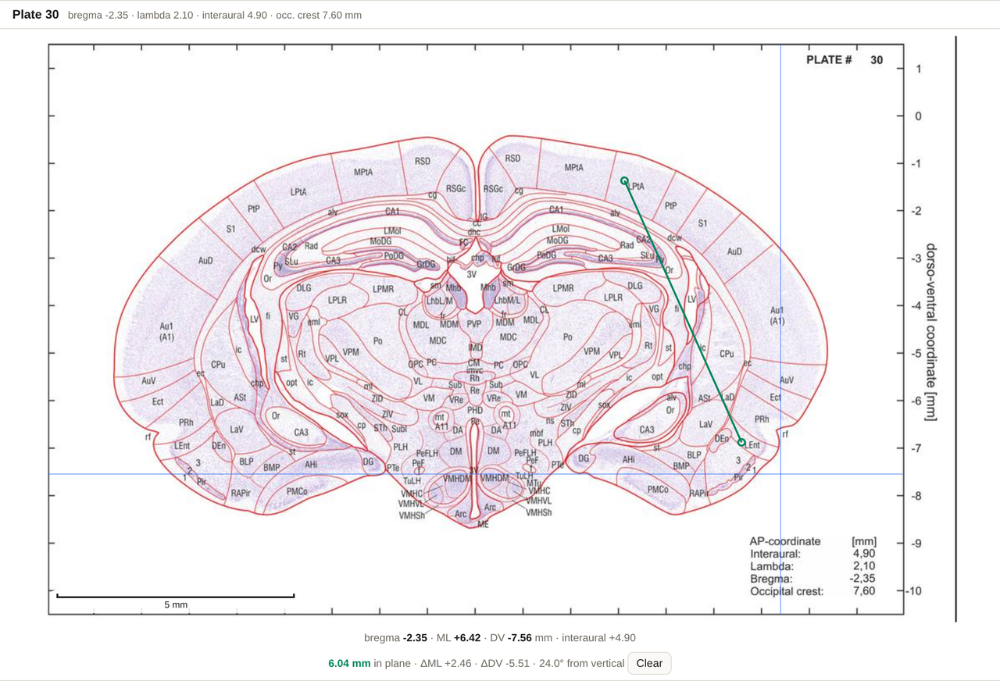
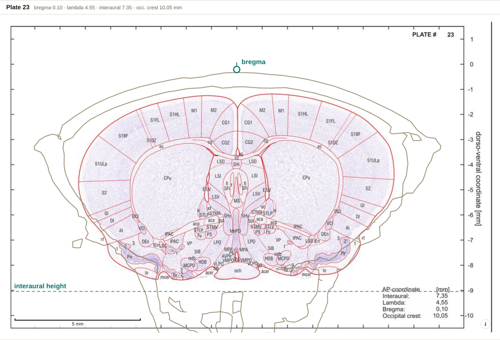

# Measuring

Four overlays above the plate turn it from a picture into something you can take numbers
off: **Grid**, **Scale**, **Measure**, and the reference overlays **Landmarks** and
**Skull**.

## Grid and scale bar

- **Grid** — a 1 mm stereotaxic grid over the section, aligned to the coordinate space
  the whole app uses.
- **Scale** — a scale bar under the plate, which relabels itself as you zoom (mm, then µm).

Both survive a source switch, so a Nissl section gets the same grid as the drawing.

## Distance and approach angle

Tick **Measure**, then click two points on the plate. The readout under the image gives:

```
2.94 mm in plane · ΔML +1.20 · ΔDV −2.68 · 24.1° from vertical
```

- **in plane** — the straight-line distance within this coronal section. Both points are
  on the same plate, so there is no AP component.
- **ΔML / ΔDV** — the two components, signed.
- **from vertical** — the angle of the line off vertical. This is the approach angle a
  straight electrode track between those two points would need in this plane.



*Two clicks on plate 30, from the dorsal surface down toward lateral entorhinal cortex:
6.04 mm in plane, ΔML +2.46, ΔDV −5.51, 24.0° from vertical.*

**Clear** resets it, as does <kbd>Esc</kbd>. Drag the second point around before you click
to see the numbers update live.

> With a **rotated** [working frame](Working-Frame) on, the millimetres still hold — a
> rotation preserves length — but the *angle* does not, so the tool stays in atlas
> coordinates and says so. Moving the origin changes neither reading, since both are
> differences.

## Landmarks

**Landmarks** marks bregma, lambda and the occipital crest on whichever plate their plane
falls in, and draws the interaural line — solid where it lies in the plane, dashed
elsewhere as the ear-bar height.



*Plate 23 is where bregma's plane falls, so bregma is marked on the section itself; the
interaural line is dashed because its plane is elsewhere, and the height is what is being
drawn. The olive outline is the CT skull's cut through this plane.*

**The AP of each is the atlas's own printed figure and is exact.** Only the *heights* — and
the ear canals the interaural line runs between — come off the skull fit, so those inherit
its approximation.

On the projection views all four become reference rules across the plot.

## Skull *(experimental)*

**Skull** traces a CT skull's cut through the current coronal plane. The same surface
appears as an outline around either [projection](Projection-and-3D) and as a translucent
shell in 3D.

The atlas prints no skull, so this fit is **computed here, not published**. The scan is a
**different animal**, aligned first on the paper's own landmarks (the coronal suture for
bregma, the ear canals for the interaural line), with the tilt, height and three axis
scales then set by the drawn sections of all 62 plates. Because the two animals are not the
same shape, the skull is stretched about 3% along AP and 4% across, and shortened 4% in
depth, to seat the vault on the cortex.

**Good to a few tenths of a millimetre. Context around the sections, not a surface to
measure against.** The **\*** button beside the checkbox opens this note in the app.

## Getting a measurement out

A measurement is included in the **PNG** and **SVG** exports (its own `measure` group in
the SVG) and in the track planner's **Copy notes** text. See [Exporting](Exporting).
