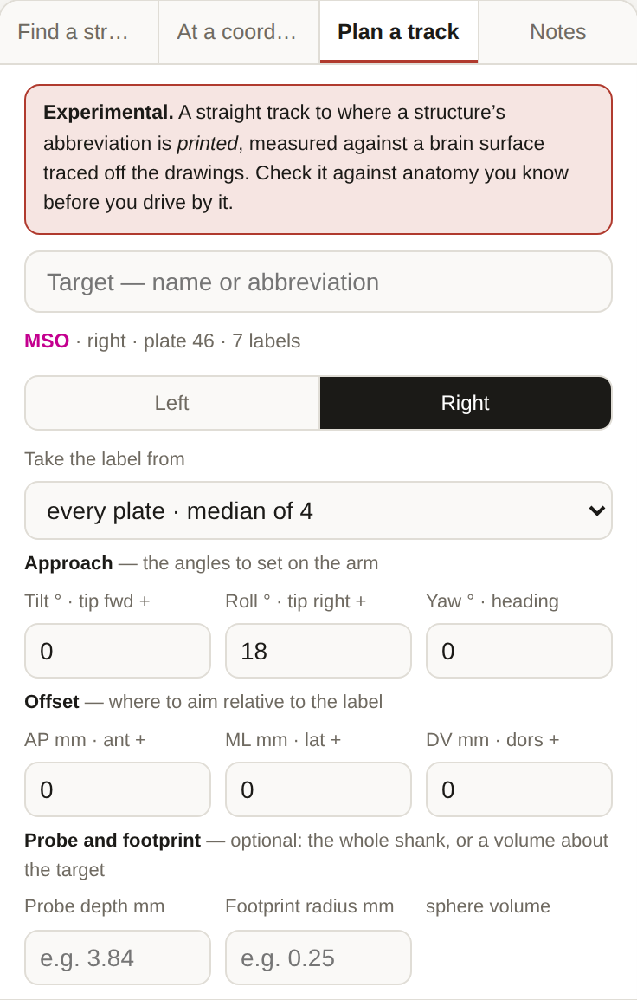
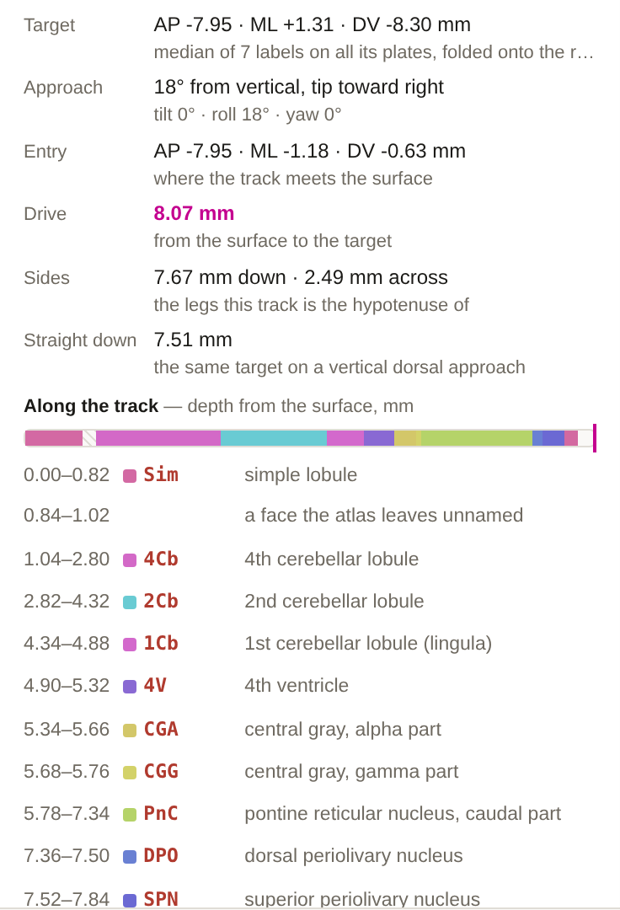
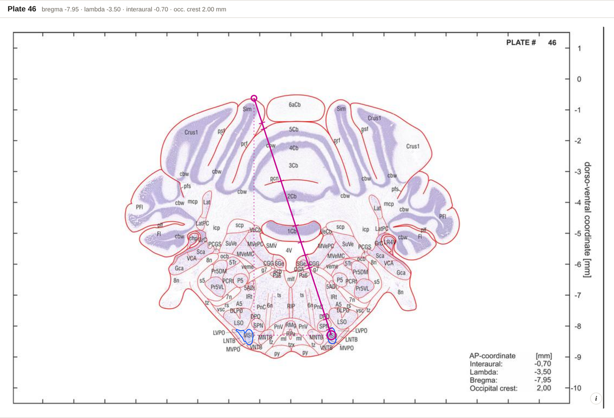

# Planning a Track

> **Experimental.** The planner is new and has **not been checked against a track anybody
> has actually driven.** Read a plan against anatomy you already know before you rely on it.

Left panel, **Plan a track**. Give it a structure, a hemisphere and three approach angles;
it gives you the entry point, the angles to dial into the manipulator, and how far to
drive from the brain surface.

## The steps

1. **Pick a target** — type a name or abbreviation into the planner's own search box, and
   click a result. (A structure already selected carries over.)
2. **Pick a hemisphere** — **Left** / **Right**.
3. **Set the angles** — all three default to 0, which is a straight vertical dorsal
   approach.

| Angle | Sign | Effect |
| --- | --- | --- |
| **Tilt** | tip forward + | Tilts about the mediolateral axis. Positive drives the tip anterior, so the **entry is behind** the target |
| **Roll** | tip right + | Rolls about the anteroposterior axis. Positive drives the tip to the right, so the **entry is left of** the target |
| **Yaw** | heading | Turns the heading that the tilt and roll point in. With both at 0 the track is vertical and there is nothing to turn, so the field is disabled |

**Straight down** resets all three.

*A plan for the right MSO at 18° of roll. Under the angles are an **Offset** — where to aim
relative to the printed label — and an optional probe depth and footprint radius.*

## What you get

| Row | Meaning |
| --- | --- |
| **Target** | AP · ML · DV of the target — the median of its printed labels, folded onto the side you chose |
| **Approach** | The angle from vertical, and which way the tip points, in words |
| **Entry** | AP · ML · DV where the track meets the brain surface |
| **Drive** | **The distance from the surface to the target** — the number you drive |
| **Sides** | The vertical drop and the horizontal offset that the track is the hypotenuse of |
| **Straight down** | What the drive would be on a vertical approach, for comparison |

*The plan for that approach: an 8.07 mm drive from an entry 2.49 mm across from the target,
against 7.51 mm straight down — and, under it, every structure the track passes through
with the depth at which it enters and leaves.*

The header line names the target, the side, the plate it falls on, and how many labels the
figure came from. Under the table, **Along the track** lists every structure the track
crosses with the depth range it spans, so you can read what the electrode goes through on
its way down.

## Seeing it

The track draws live on the plate, on both projections, and in the 3D view.

On the plate it is **solid** where it genuinely lies in that section (within half a section
of the plate's AP) and **dashed** where it is only the projection of a track passing in
front of or behind that plane. An entry or target that is not on the current plate is
ghosted for the same reason.

*The same track on plate 46: solid where it lies in this section, dotted where it is the
projection of a track passing in front of or behind the plane.*

**Right-triangle sides** adds the vertical drop and horizontal offset as two legs — what
you set on the arm before you lower it.

## Warnings it will give you

- *The label sits outside the traced outline of its plate* — the atlas prints some
  abbreviations beside the section and points at them with a leader. The track is measured
  to it anyway; read the entry with that in mind.
- *The entry is on the flank of the section, not its dorsal surface* — this track goes in
  through the side of the head.
- *No surface lies along this direction from the target* — there is nothing to enter
  through on that heading.

## The angles are in **your** frame

This is the part most worth understanding. If you have set a
[working frame](Working-Frame), the plan is expressed in **your** frame, not the atlas's —
because the angles you type are the ones you will set on the manipulator.

At 17° of nose-down pitch, a track that is vertical on the manipulator enters about
**2.1 mm further back** than the plate alone would suggest.

## Taking it with you

- **Copy notes** — the plan as plain text, including the frame it was planned in and any
  measurement you had on the plate.
- **Download** — the same as a text file.
- **Copy link** — a URL that restores the whole plan: target, side and all three angles.

## What the surface is

The brain surface the planner measures against is the **outline of the atlas's own drawn
section**, traced off the plates. It reaches DV 0 and never crosses it, and 98% of printed
labels fall inside it.

It is a **fixed, sectioned** brain — not the surface under intact dura — and it knows
nothing about vessels, the sinus or the ventricles. Sections are 350 µm apart, so an entry
AP is only resolved to the nearest plate.

---

The design behind the planner, and the questions that had to be settled first:
[TARGETING_PLAN.md](https://github.com/dstolz/GerbilAtlasExplorer/blob/main/TARGETING_PLAN.md).
