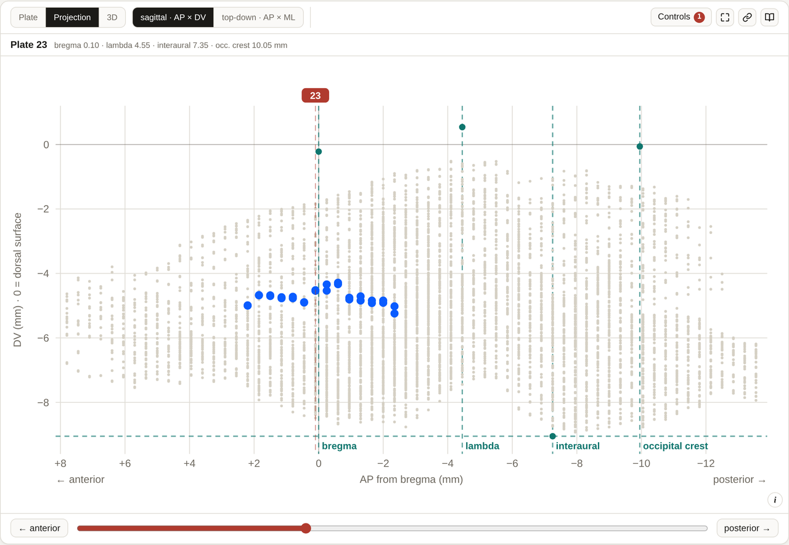
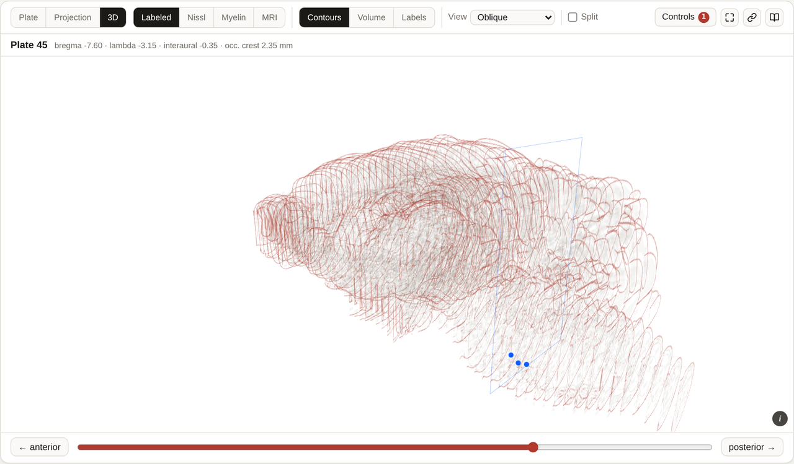
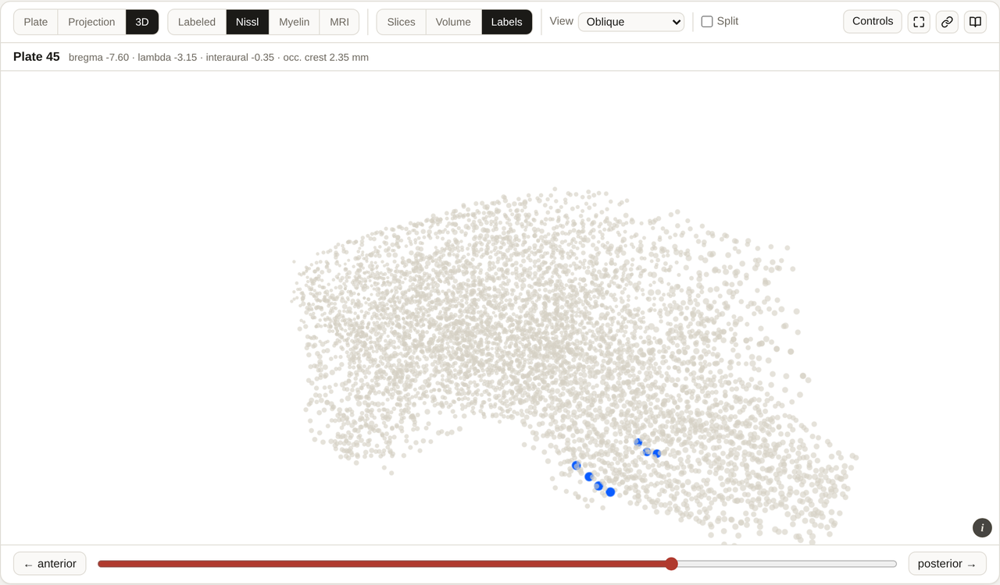

# Projection and 3D

The printed atlas gives you one coronal plane at a time. These two views put the third
axis back, so you can see how a structure runs through the brain.

Both are built from data already on the page — nothing extra is downloaded.

---

## Projection

Every located label in the atlas, plotted as a scatter, with your selected structure
highlighted in blue.

*Every printed label in the atlas as one scatter, sagittal. The caudate putamen is picked
out in blue — the run of labels the atlas prints for it, bregma +2.20 to −2.35. The four
landmark rules are on, and the red guide marks where the plate viewer is sitting.*

Two orientations:

| Button | Plot |
| --- | --- |
| **sagittal · AP × DV** | Side view — how deep a structure sits, and how far it runs front to back |
| **top-down · AP × ML** | From above — how far lateral it sits |

- **Hover** a dot to read its structure, plate and coordinates.
- **Click** a dot to jump to that structure's plate.
- **Click the empty plot** at an AP to scrub the plate viewer to that level.
- A vertical guide shows where the plate viewer is currently sitting.
- **Landmarks** adds bregma / lambda / interaural / occipital-crest reference rules;
  **Skull** outlines the skull around the cloud, widening the axes to fit it.

The caption under the plot tells you how many labels the selected structure has and on how
many plates. If a structure has none, it says that instead of plotting nothing.

---

## 3D

The 62 plates stacked where they actually sit — each section drawn at its own bregma.
**Needs WebGL 2.** It builds once, the first time you open it.

### Three renderings

| Mode | What it draws |
| --- | --- |
| **Contours** | The atlas's own drawn boundaries as a stack of sections |
| **Volume** | The same field, ray-marched as a solid |
| **Labels** | All **6,220** printed abbreviations as a stereotaxic point cloud |

*The 62 drawn sections stacked where they sit, cut at the midline with **Half**. The blue
dots are the selected structure's printed labels; the blue rectangle is the plate the
viewer is on.*

*The same brain as **Labels**: all 6,220 printed abbreviations as a stereotaxic point cloud,
with the selected structure's own labels in blue.*

The stack is built from **whichever source is selected** above the plate — so you can stack
the drawings, the Nissl sections or the myelin sections.

### Controls

| Control | What it does |
| --- | --- |
| **Density** | How strongly each slice contributes — the 3D view's version of Contrast |
| **Plates** … **–** | Two sliders that clip the stack to a slab, anterior and posterior edge |
| **Half** | Cut at the midline to see inside |
| **Ortho** | Parallel projection — nothing is foreshortened, so equal lengths read equally at any depth. Use it when comparing positions rather than looking at the brain |
| **Skull** \* | Wrap the stack in the CT skull surface, with a **Bone** opacity slider |
| **Reset view** | Back to the default viewpoint |

### Navigating

| Action | How |
| --- | --- |
| Orbit | **Drag** |
| Pan | **Shift-drag** or **right-drag** |
| Zoom | **Wheel** |

---

## What these views are not

- **Nothing here is a segmentation.** The contours are the atlas's drawn boundaries; the
  labels are where abbreviations are *printed*.
- **The streaking in the volume view is arithmetic, not anatomy.** Sections are 350 µm
  apart but a plate pixel is about 17.5 µm — sampling *along* the brain is 20× coarser
  than across it. The stack really is discrete, and the volume interpolates between slices.
- **A single structure reads as a sparse arc, not a shape.** Most structures carry only a
  handful of labels — the median is six.
- For thin layered structures a label is often printed just *outside* the structure itself.
