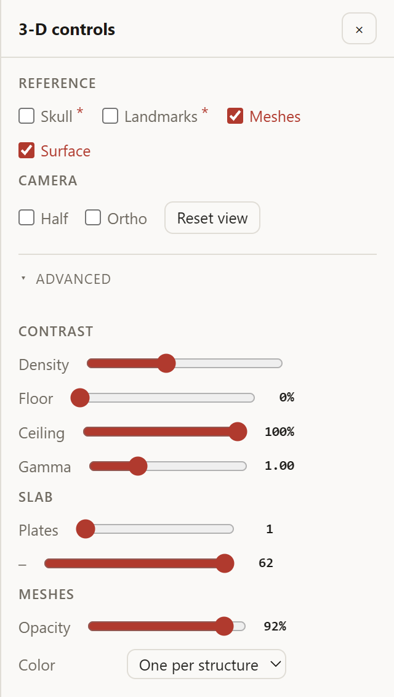
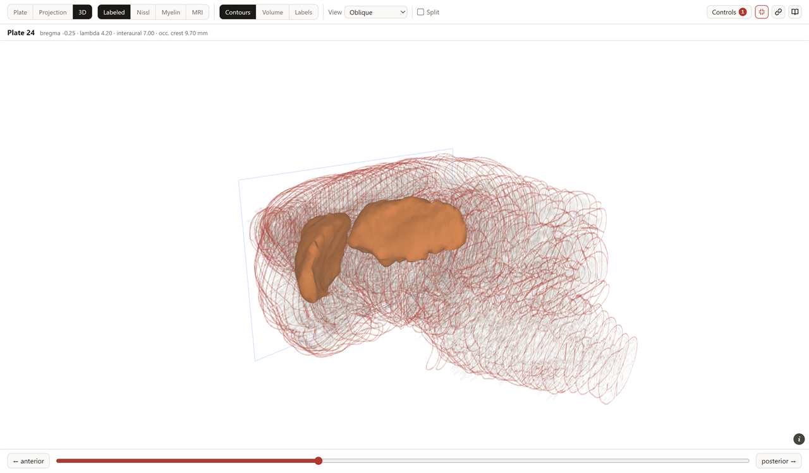
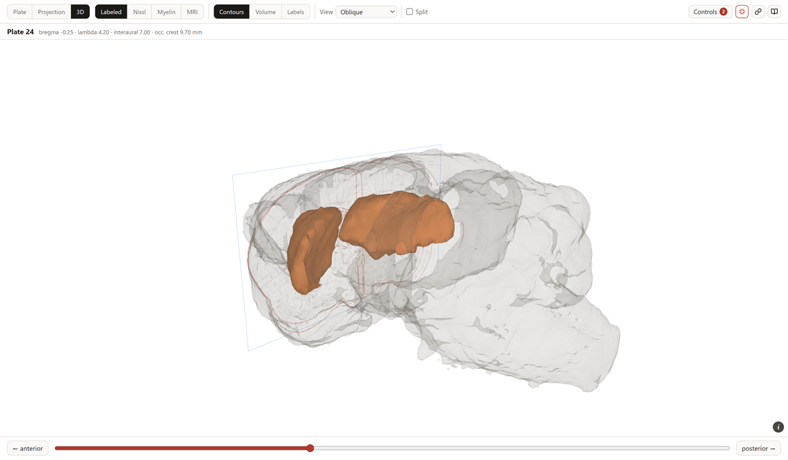
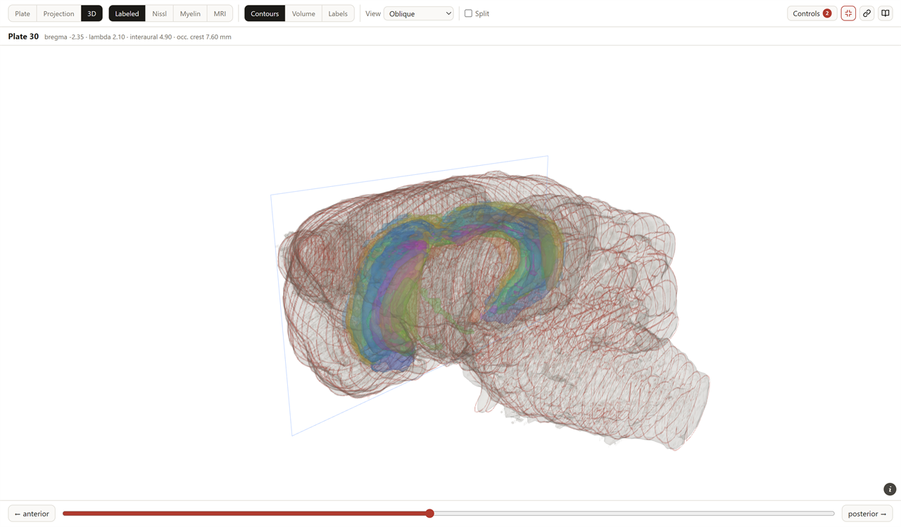
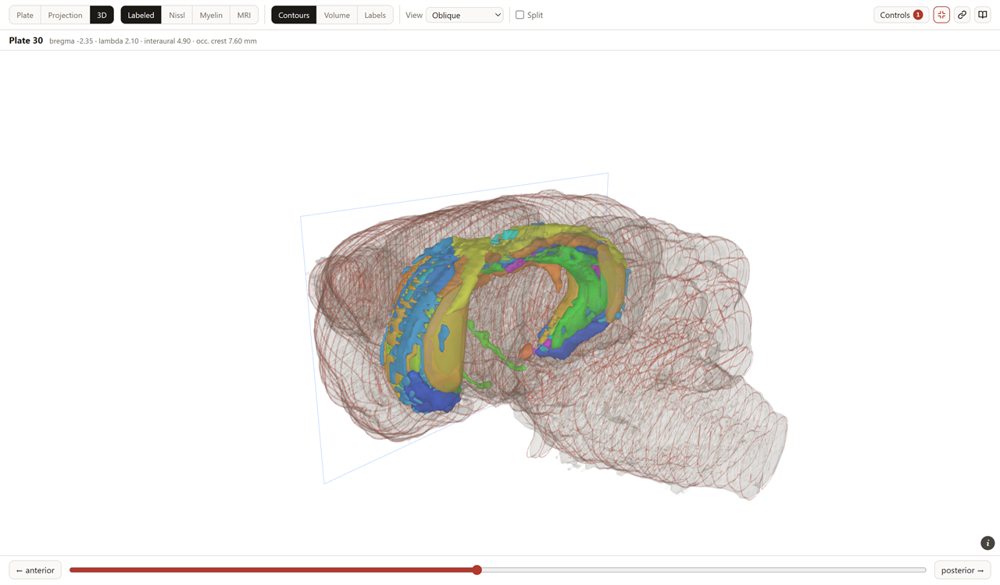
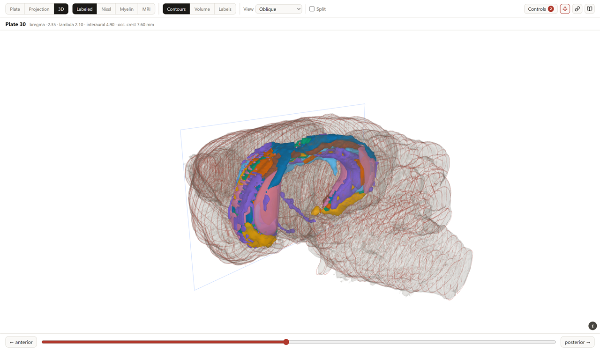

# Projection and 3D

The printed atlas gives you one coronal plane at a time. These two views put the third
axis back, so you can see how a structure runs through the brain.

Both are built from data already on the page — nothing extra is downloaded.

---

## Projection

Every located label in the atlas, plotted as a scatter, with your selected structure
highlighted in blue.

*Every printed label in the atlas as one scatter, sagittal. The caudate putamen is picked
out in blue — the run of labels the atlas prints for it, bregma +2.20 to −2.35. The four
landmark rules are on, and the red guide marks where the plate viewer is sitting.*

Two orientations:

| Button | Plot |
| --- | --- |
| **sagittal · AP × DV** | Side view — how deep a structure sits, and how far it runs front to back |
| **top-down · AP × ML** | From above — how far lateral it sits |

- **Hover** a dot to read its structure, plate and coordinates.
- **Click** a dot to jump to that structure's plate.
- **Click the empty plot** at an AP to scrub the plate viewer to that level.
- A vertical guide shows where the plate viewer is currently sitting.
- **Landmarks** adds bregma / lambda / interaural / occipital-crest reference rules;
  **Skull** outlines the skull around the cloud, widening the axes to fit it.

The caption under the plot tells you how many labels the selected structure has and on how
many plates. If a structure has none, it says that instead of plotting nothing.

---

## 3D

The 62 plates stacked where they actually sit — each section drawn at its own bregma.
**Needs WebGL 2.** It builds once, the first time you open it.

### Three renderings

| Mode | What it draws |
| --- | --- |
| **Contours** | The atlas's own drawn boundaries as a stack of sections |
| **Volume** | The same field, ray-marched as a solid |
| **Labels** | All **6,220** printed abbreviations as a stereotaxic point cloud |

*The 62 drawn sections stacked where they sit, cut at the midline with **Half**. The blue
dots are the selected structure's printed labels; the blue rectangle is the plate the
viewer is on.*

*The same brain as **Labels**: all 6,220 printed abbreviations as a stereotaxic point cloud,
with the selected structure's own labels in blue.*

The stack is built from **whichever source is selected** above the plate — so you can stack
the drawings, the Nissl sections or the myelin sections.

### Controls

| Control | What it does |
| --- | --- |
| **Density** | How strongly each slice contributes — the 3D view's version of Contrast |
| **Plates** … **–** | Two sliders that clip the stack to a slab, anterior and posterior edge |
| **Half** | Cut at the midline to see inside |
| **Ortho** | Parallel projection — nothing is foreshortened, so equal lengths read equally at any depth. Use it when comparing positions rather than looking at the brain |
| **Skull** \* | Wrap the stack in the CT skull surface, with a **Bone** opacity slider |
| **Meshes** | Draw structures as closed shapes instead of sections — see [below](#meshes-and-the-brain-surface) |
| **Surface** | The interpolated brain surface as a faint shell. Only there once **Meshes** is on |
| **Reset view** | Back to the default viewpoint |

### Meshes and the brain surface

Everything above draws the atlas as *sections* — 62 of them, and the gaps between. **Meshes**
draws it as *shapes*: one closed surface per structure, built offline from the same drawn
extents the plate's outlines and colors come from, so a mesh and the outline on the plate
under it are the same boundary read two ways.

*Ticking **Meshes** reveals **Surface** beside it, and adds a **Meshes** group — **Opacity**
and **Color** — to the folded **Advanced** half of the panel.*

The meshes live in `data/gerbil_atlas_volumes.json`, about **20 MB**. That is far too big to
carry in the page, so it is fetched the first time you tick the box and then kept — including
by the second pane of a **Split**, which reads the same cache.

- Served over `http://` or `https://`, it is fetched for you.
- Opened from disk as a `file://` page it cannot be fetched at all, and a **Load file** button
  appears instead: point it at `data/gerbil_atlas_volumes.json` in your own copy of the
  repository.

**697 structures carry an area and get a mesh.** The rest get nothing, and the note under the
view says which of two reasons applies rather than leaving an unexplained blank: either the
atlas names the structure but draws it no region on any plate, or it is a feature — a fissure,
a vessel — that could never have one.

*CPu as a mesh, standing in the contour stack. Two shapes and not one: nothing is cut at
ML 0, so a bilateral structure comes out as the two components the atlas actually draws. The
note under the view gives the volume — 49.87 mm³.*

With the meshes on, **the label cloud stands down**. It would otherwise be a fog of dots
duplicating shapes the mesh already draws. The exception is **Labels** mode, where the cloud
*is* the rendering, so there both are shown.

Contours is the mode to pair meshes with. **Volume** re-marches the tissue in front of them
and mostly buries them.

Two of the camera controls treat meshes differently, which is worth knowing before it
surprises you. **Half** cuts the meshes and the shell along with the stack. The **Plates**
slab does not: it clips the *tissue* only, so a mesh and the shell stay whole however far in
you pull it — which is what makes the **Surface** figure below legible.

#### Which meshes are drawn

| What you have selected | What the view draws |
| --- | --- |
| A structure with its own mesh | that mesh |
| A structure printed inside a shared region — **A1**, in *Au1 (A1/AAF)* | the mesh filed under the name the label leads with, **Au1**, which is the region the plate outlines too |
| A **division** | one mesh per member, up to 140; past that the largest of them, and the note says how many were left out |
| Nothing selected, but a filter down to **40 results or fewer** | one mesh per result |

A division has no mesh of its own and never will — it is its members' meshes standing
together, exactly as its outline on a plate is their outlines unioned. The note adds them up:
the hippocampal formation below is **24 meshes, 64.13 mm³**; the cerebral cortex is **65
meshes of its 68 structures** — the other three the atlas draws no region for — and 333.96 mm³.

#### Surface

**Surface** appears once **Meshes** is on, and wraps everything in the interpolated brain
surface as a faint shell. It gives a structure a body to sit in: on its own a mesh floats,
and against 62 contour rings it is hard to place.

*The same CPu with **Surface** on, and the **Plates** slab pulled in to two sections so the
shell is not competing with the whole stack. The shell is the brain outline interpolated the
same way the structures are — the outer boundary of the same field.*

The shell is depth-tested against whatever the meshes wrote, so it follows **Opacity** below
without being told: solid meshes occlude it, and translucent ones let it lie over them.

**Surface is the one 3-D setting that does not ride in a link.** **Meshes**, the opacity and
the color are all carried; the shell is not, so someone opening your link gets the meshes
without it and ticks the box themselves.

#### Opacity

At the default **92%** and above, the meshes are solid enough to sort themselves: one
depth-writing pass, nearest surface wins. Turn it down and they are composited back to front
instead — which is the whole of what lets a structure *inside* another one show through it.

*The hippocampal formation at 35%. At the default the outer subfields hide the inner ones
completely; composited, the whole nested set reads at once.*

Compositing is ordered by each mesh's own center against the camera. The shapes here are
compact and it holds for them, but two that genuinely interleave can still come out in the
wrong order. Double-click the slider to put it back to 92%.

#### Color

Three answers to what a mesh's color means, and none of them is anatomy.

| Option | What decides the color |
| --- | --- |
| **One per structure** *(default)* | A hue hashed from the structure's own name. The same abbreviation is the same color in every session and either pane — but 360 degrees and 697 names, so two can land on the same hue |
| **Plate colors** | The plate's own coloring lifted into the third dimension: the eight slots solved so that no two regions touching on a plate are alike, and the same color on every plate a region is drawn on |
| **Selection** | The selected structure in the color the plate marks it with, and a division's members all in the division's one color |

*The hippocampal formation as 24 meshes in **One per structure**. This is the case the default
exists for: one structure is one shape and any color draws it, but a division has to say which
of its members you are looking at before it says anything else.*

*The same 24 meshes in **Plate colors** — eight colors rather than 24, and each one the color
that structure wears on the section underneath it. This is the mode that makes the plate and
the 3-D view one picture. Adjacency in depth was never part of that solve, so two meshes that
meet only in the gap between two sections can still come out alike.*

**Selection** is the mode for "where is this", rather than "which of these am I looking at".

#### In a link

`&mh=1` carries the meshes, `&mo=` the opacity and `&mc=` the color; `&mh2`, `&mo2` and `&mc2`
do the same for pane B. A link carrying any of them opens with **Advanced** already unfolded,
so a folded panel is never the reason the picture looks the way it does.

### Navigating

| Action | How |
| --- | --- |
| Orbit | **Drag** |
| Pan | **Shift-drag** or **right-drag** |
| Zoom | **Wheel** |

---

## What these views are not

- **Nothing here is a segmentation.** The contours are the atlas's drawn boundaries; the
  labels are where abbreviations are *printed*.
- **The streaking in the volume view is arithmetic, not anatomy.** Sections are 350 µm
  apart but a plate pixel is about 17.5 µm — sampling *along* the brain is 20× coarser
  than across it. The stack really is discrete, and the volume interpolates between slices.
- **A single structure reads as a sparse arc, not a shape.** Most structures carry only a
  handful of labels — the median is six.
- **A mesh is interpolated, not segmented.** The atlas is 62 drawings and nothing between
  them. The meshes fill the gap at 50 µm, so **six planes in seven are arithmetic** — a linear
  guess along the brain, not a measurement. Where a structure really changes shape inside
  350 µm, and thin laminae do, the mesh cannot show it.
- **Some meshes are hulls rather than shapes.** A structure drawn on only one or two plates is
  never sampled along AP at all, so it is closed as a convex hull per component: a claim about
  where it is, not about what shape it is. 433 of the 697 follow the drawn boundaries; the
  other 264 are hulls, and the note says which you are looking at.
- For thin layered structures a label is often printed just *outside* the structure itself.
