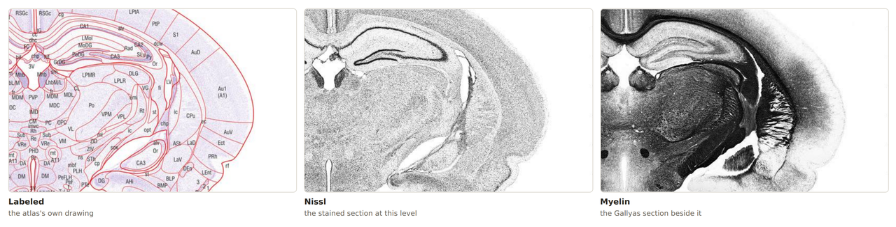
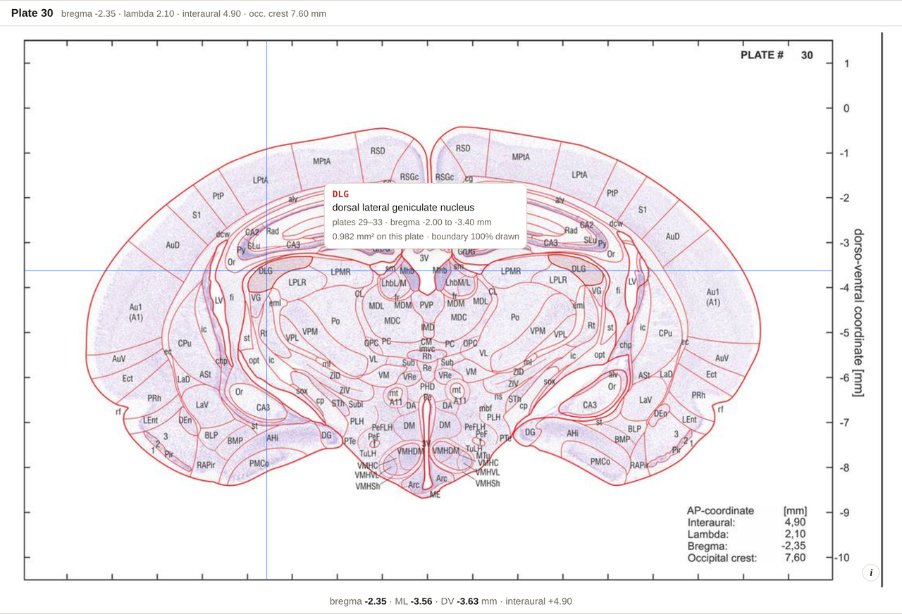
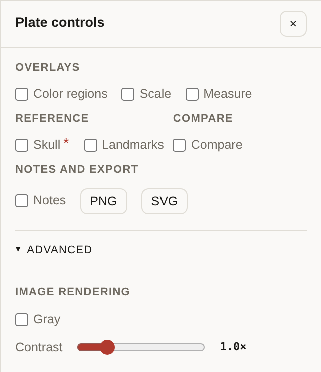

# Reading a Plate

The **Plate** view is the default, and the one you will spend most time in.

Everything the plate is steered by sits in one strip: the view, the source, the zoom, the
two overlays you reach for most — and **Controls**, which opens the rest.

## Moving between plates

- The **← anterior** / **posterior →** buttons and the slider at the bottom.
- The <kbd>←</kbd> and <kbd>→</kbd> keys.
- Typing `plate 30`, `p30` or `bregma -2.3` into the search box.
- Clicking a plate number on a selected structure's card.

Plate 1 is the most anterior (bregma **+7.80 mm**); plate 62 the most posterior
(bregma **−13.55 mm**). Sections are **350 µm** apart. The strip above the image always
shows the plate number and its AP.

## Labeled · Nissl · Myelin

The atlas prints every level three times, and all three are here:

| Button | What it shows |
| --- | --- |
| **Labeled** | The atlas's own drawing — contours and printed abbreviations |
| **Nissl** | The unlabelled Nissl-stained section at that level |
| **Myelin** | The unlabelled Gallyas myelin-stained section printed beside it |

*The same corner of plate 30 — hippocampus, thalamus and auditory cortex — at the same
zoom and pan in all three sources. Switching source moves nothing.*

**They are registered to each other**, because each of the 186 pages carries the atlas's
own printed ML/DV coordinate box and each was cropped to its own box. So switching source
moves nothing: the grid, the scale bar, the measure tool, the circled structure and the
hover readout are all still in the right place on a section with nothing printed on it —
and hovering where the drawing prints an abbreviation *still names it*, even on the Nissl.

Two extras, under **Controls → Advanced**:

- **Gray** — drops the drawing's colour so all three read alike. The histology was
  published in grey already.
- **Contrast** — stretches whichever source is showing, 0.6× to 2.6×.

Both carry into the PNG and SVG exports.

> The myelin plate is an **adjacent** section, not the same slice as the Nissl — the two
> stains cannot both be applied to one section. It is aligned as the authors published it.

## Zoom and pan

| Action | How |
| --- | --- |
| Zoom in / out | **+** / **−** buttons, or the <kbd>+</kbd> / <kbd>−</kbd> keys |
| Zoom to a point | **Double-click** the plate there |
| Pan | **Drag** |
| Back to fit | **Fit** button, or the <kbd>0</kbd> key |

The current zoom level shows between the buttons.

## Hovering

Two things happen under the pointer, independently:

- **Any point** — with **Coords** ticked, the readout under the plate gives bregma / ML /
  DV for that point, continuously.
- **A printed abbreviation, or the region it names** (Labeled source, or the same spot on
  Nissl/Myelin) — a tooltip gives the full name, the plates it runs over, and how much area
  the region has on this plate. **Click it** to select that structure.

*Hovering the dorsal lateral geniculate nucleus: the region is outlined in both hemispheres,
the tooltip names it, and with **Coords** on the readout under the plate follows the pointer.*

## The overlays

**Coords** and **Grid** are on the toolbar. Everything else is behind **Controls** — the
button at the right of the toolbar, which opens a panel beside the plate. <kbd>C</kbd>
opens it, <kbd>Esc</kbd> closes it, and a badge on the button counts what is on.

| Toggle | What it draws |
| --- | --- |
| **Coords** *(toolbar)* | The bregma / ML / DV readout under the pointer |
| **Grid** *(toolbar)* | A 1 mm stereotaxic grid over the section |
| **Color regions** | Fills every region so that no two that touch are the same colour, at a wash you set. The colours name nothing — they only tell neighbours apart |
| **Scale** | A scale bar |
| **Measure** | Click two points for distance and approach angle — see [Measuring](Measuring) |
| **Skull** \* | The CT skull's cut through this coronal plane *(experimental)* |
| **Landmarks** | Bregma, lambda and the occipital crest where they fall, plus the interaural line |
| **Compare** | A second plate beside this one, sharing zoom, pan and crosshair: the other histology of this level, the drawing, or the plate before or after |
| **Notes** | Your own markers on the plates, kept in this browser |

The **\*** beside *Skull* opens the note on why its alignment is approximate.
**Advanced**, at the foot of the panel, holds *Gray* and *Contrast*.

Every toggle is carried in **Copy link**, so a link restores the view you were looking at.

## Getting it out

**PNG** and **SVG** sit under **Controls → Notes and export**. PNG saves the plate as
shown, with the overlays and a coordinate caption; SVG saves the same sheet as editable
vector paths instead of an image. See [Exporting](Exporting).
