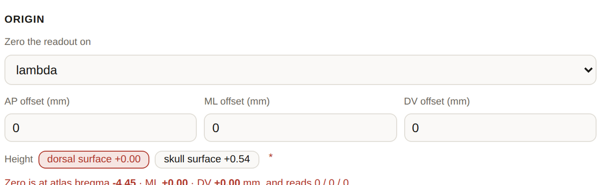
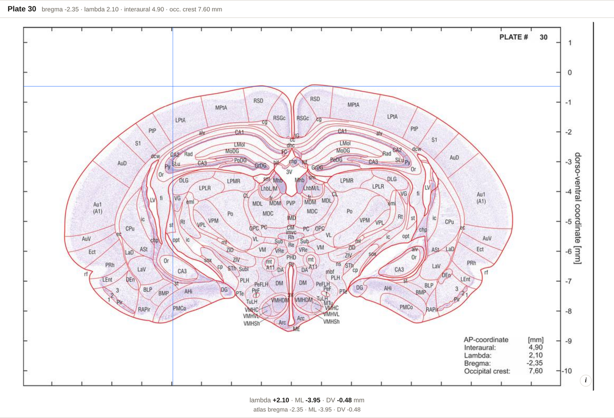

# Working Frame

**Frame** in the header. Two independent jobs live here:

1. **Where zero is** — exact, and safe to rely on.
2. **How the head is tilted** — **experimental**.

You can use the first without touching the second. Leave every angle at 0 and moving the
origin is *all* the dialog does.

---

## Part 1 — Where zero is (exact)

The common case: **read from lambda instead of bregma.**

1. Open **Frame**.
2. Under **Origin**, set *Zero the readout on* → **lambda**.
3. **Turn on**.

Every coordinate in the app is now measured from lambda, and the readouts say so —
`lambda +2.10` rather than a bare `AP`, with the atlas's own figure kept on the line beneath.

*The pointer readout under plate 30 with the origin on lambda: `lambda +2.10 · ML −3.95 ·
DV −0.48`, and the atlas's own reading of the same point on the line under it.*

### If your zero is not quite on a landmark

The three offset fields under the dropdown are an **offset from the landmark**, not an
absolute coordinate. So "half a millimetre behind lambda" is: *lambda*, AP offset
**−0.50**. Anterior, right and dorsal are positive, as everywhere else.

Leave them at 0 and zero is the landmark itself.

### Two things about landmarks

- **A landmark sets AP only.** The atlas prints an AP for bregma, lambda, the interaural
  line and the occipital crest — and neither an ML nor a height for any of them. On those
  two axes the offset is the whole story. Leave DV at 0 to zero on the **brain's dorsal
  surface**, or enter the depth you actually zeroed at.
- **DV 0 is the brain surface, not skull bregma.** They differ by roughly the skull
  thickness. Zeroing on bone? The **Height** chips beside the offsets carry that difference
  for you — *dorsal surface +0.00* or *skull surface +0.54* — or put your own figure in the
  DV offset.

### Why this one needs no hedging

**Moving zero moves no point.** It is a subtraction. Every distance and every angle is the
one the atlas printed, so the projections and the 3D view read their axes from your origin
too, and the measure tool needs no caveat.

---

## Part 2 — Orientation *(experimental)*

> **Pitch, roll and yaw are new and not fully tested.** Check any coordinate they adjust
> against anatomy you already know before relying on it.

The atlas is cut **perpendicular to the brainstem axis**, which is not how a head sits in
any particular stereotaxic frame. If yours holds it at another angle, describe that angle
here and coordinates are read in *your* frame.

| Field | Sign |
| --- | --- |
| **Pitch** | nose down + |
| **Roll** | right ear down + |
| **Yaw** | nose right + |

Applied about the pivot, in the order **yaw → pitch → roll**. Rotations do not commute, so
the order is part of the definition — though at a few degrees of roll and yaw it makes no
measurable difference.

### Getting the angle from measurements

Take two readings off the skull with the electrode. The angle is
`atan(difference ÷ separation)`, and the dialog will do it for you.

**Use the widest span the skull gives you.** A 0.1 mm depth error is **1.3°** over the
4.45 mm from bregma to lambda, but only **0.58°** over the 9.95 mm to the occipital crest.

### Pivot

The point the rotation turns about — in practice, **wherever you zero the manipulator**. It
matters more than the angles do, because a coordinate moves further the further it sits
from the pivot.

- The default 0 / 0 / 0 is the atlas origin: bregma in AP, midline in ML, brain surface
  in DV.
- **A preset sets AP and ML only** — same reason as above, the atlas prints no landmark
  heights. This matters most for the **interaural** preset: pitch turns about a
  mediolateral axis, so the ear-bar axis is the true pivot only once DV says how far below
  your zero it sits (a negative number, in your own frame). Left at 0, the rotation happens
  at the brain's dorsal surface instead — a parallel axis several millimetres too high.
- Pitch alone ignores the pivot's ML, so a preset puts it on the midline. Roll and yaw do
  use it.

**If you set an Origin, the pivot stops mattering** — rotating about any point and then
re-zeroing on the origin is the same as rotating about the origin.

### Offset

A pure translation, added **after** the rotation. A dura-versus-skull DV zero belongs here.

### Check the signs

Nothing in the atlas records which way *your* frame is tilted, so the app cannot check a
sign for you. The **Check the signs** preview shows a coordinate moving under your
settings — read it against a structure you already know. **If it moved the wrong way,
negate the angle.**

---

## What the frame changes

| Adjusted | Left in atlas coordinates *while rotated* |
| --- | --- |
| The structure card | The 1 mm grid |
| The pointer readout on the plate | The measure tool |
| The coordinate lookup | The projections |
| The CSV export | The 3D view |

Each of the four on the right says so on screen while it is on. **An origin on its own is
the exception** — with no rotation, all of them read from your origin too.

## Two consequences of a rotation

- **A plate is no longer a single AP.** At 17° of pitch, the AP of a point drifts about
  0.29 mm per millimetre down the plate — some 2.5 mm across the depth of the brain. That
  is why the readout gives an AP *per point* rather than one figure for the plate.
- **This is a rigid rotation of the published numbers, not a resectioning.** No oblique
  plate is drawn, because plates are 350 µm apart against about 17.5 µm within a plate —
  a cut at an angle would be interpolation rather than anatomy.

Treat an adjusted coordinate as a targeting aid carrying the atlas's own error, plus your
alignment error, plus animal-to-animal skull variation.

## Turning it off

**Reset to atlas** puts everything back. The frame is carried in **Copy link**, and the
CSV export records the full frame specification in its own column, so a file read a year
later still says which frame produced its numbers.
